# Končno poročilo

## Problem

Na slovenskih cestah je ogromno avtomobilov z različnimi karakteristikami, kot so motorji na različna goriva, prostornina motorja, starost vozila itd. Preučevali smo avtomobile, ki so registrirani v Sloveniji, in trg, na katerem se prodajajo.

## Podatki, ki smo jih obravnavali

Uporabili smo javno dostopne podatke iz evidence registriranih vozil v Sloveniji za leto 2023:  
[https://podatki.gov.si/dataset/evidenca-registriranih-vozil-presek-stanja](https://podatki.gov.si/dataset/evidenca-registriranih-vozil-presek-stanja)

Podatkovni set vsebuje različne informacije o vozilih, kot so datum prve registracije, lokacija registracije, znamka in model, vrsta goriva, emisije CO₂, masa vozila, moč motorja in prevoženi kilometri.

Ker podatki vsebujejo tudi veliko nerelevantnih atributov (npr. administrativne oznake), smo izvedli čiščenje podatkov v Excelu in Pythonu (knjižnica pandas). Odstranili smo manjkajoče in nelogične vrednosti ter poenotili zapise kategorij (npr. vrste goriva).

Za preučevanje trga rabljenih avtomobilov smo uporabili Apify spletni pajek (https://apify.com/3x1t/mobile-de-scraper), ker domači trg ni zagotavljal zadostnega vzorca za zanesljivo napoved cen. Pridobili smo podatke za šest najbolj priljubljenih modelov avtomobilov v Sloveniji. Za vsak model smo zbrali 500 oglasov iz mobile.de.

### Za analizo smo uporabili:

- Python kot programski jezik za obdelavo podatkov, analizo in razvoj modelov strojnega učenja.
- knjižnico **pandas** za uvoz, čiščenje in strukturiranje podatkov.
- knjižnico **matplotlib** in **seaborn** za vizualizacijo podatkov in prikaz rezultatov analize.
- knjižnico **scikit-learn** za razvoj in vrednotenje modela strojnega učenja, pri čemer smo uporabili ansambel algoritmov **StackingRegressor** (kombinacija ExtraTreesRegressor, HistGradientBoostingRegressor in RidgeCV) za regresijske napovedi.
- preprocessing **Pipeline** z **RobustScaler** in **SimpleImputer** za robustno obdelavo vhodnih podatkov.
- metodo **5-kratne prečne validacije** (5-fold cross-validation) za zanesljivo oceno uspešnosti modela.
- metriko **Mean Absolute Error (MAE)** za oceno natančnosti napovedi modela.
- knjižnico **Streamlit** za razvoj interaktivne spletne aplikacije za prikaz rezultatov in izvajanje napovedi.

## Analiza

Analizo smo razdelili na dva dela. Najprej smo s pomočjo evidence registriranih vozil preučevali trende na naših cestah: katere znamke so priljubljene, katera goriva Slovenci preferirajo, kako na to vplivajo električna vozila in katera so najbolj priljubljena. Zanimale so nas tudi emisije in poraba. Na podlagi teh ugotovitev smo vzeli šest avtomobilskih modelov, ki so se največkrat pojavljali, in s pomočjo napovedovalnega modela, ki je uporabil 500 podatkov za vsak model, skušali čim bolje oceniti vrednost rabljenega avtomobila glede na njegove karakteristike.

V evidenci registriranih avtomobilov do leta 2023 je 1.311.778 vozil, kar pomeni približno 0,6 avtomobilov na prebivalca.

V evidenci so različno stara vozila, ki so približno normalno porazdeljena — največ avtomobilov je starih 9 let. Opazimo padca pri starosti 16 in 27 let, kar sovpada z gospodarsko krizo (2009–2010) in splošnim upadom prodaje novih vozil v tistem obdobju. Gre za realen pojav v podatkih, ne za manjkajoče vnose.

Katera goriva pa Slovenci točijo v svoje avtomobile? Trenutno prevladuje dizel, vendar to se hitro spreminja, kot prikazuje graf trenda.

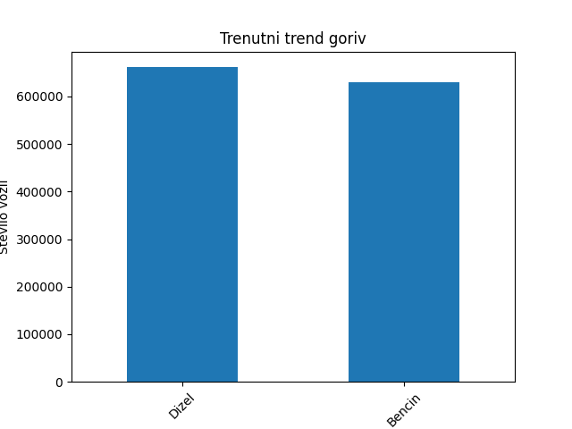

Graf trenda kaže, da bencin narašča in je v zadnjih letih prehitel dizel po priljubljenosti. Menimo, da to sovpada z rastjo števila mestnega prebivalstva, kjer so bencinski motorji primernejši za krajše razdalje in so pogosto učinkovitejši.

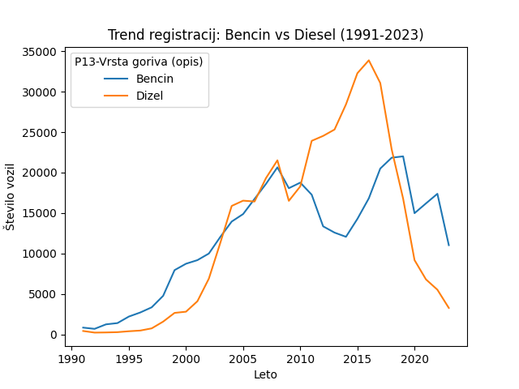

Ni pa več samo izbira med fosilnimi gorivi — trg električnih vozil je v zadnjih letih močno narastel. Rast se je začela okrog leta 2016 in je strmo naraščala do leta 2022. Ni mogoče zanesljivo sklepati, ali se je rast upočasnila ali še vedno strmo narašča, saj imamo podatke le do 2023.

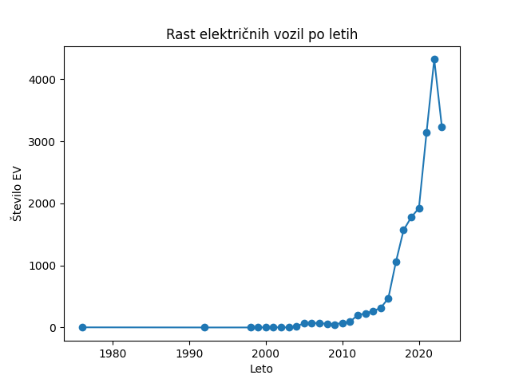

Električna vozila imajo omejitve glede dosega, zato smo pogledali, kje so najbolj priljubljena. Kot prikazuje graf, je največja rast v večjih mestih — Ljubljana narašča najhitreje, sledi Maribor, manjša mesta pa imajo bistveno manjšo rast.

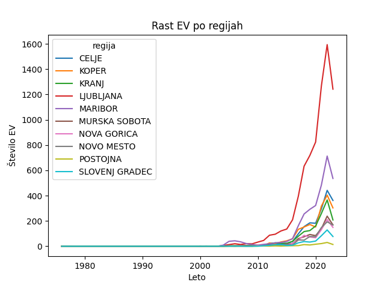

Z okoljskega vidika opazimo napredek na dveh frontah: električna vozila prinašajo nižje emisije, hkrati pa tudi novejši avtomobili na fosilna goriva izpuščajo manj CO₂. Analizo smo omejili na vozila, registrirana po letu 2004, ker starejši zapisi v registru pogosto nimajo vpisanih vrednosti CO₂.

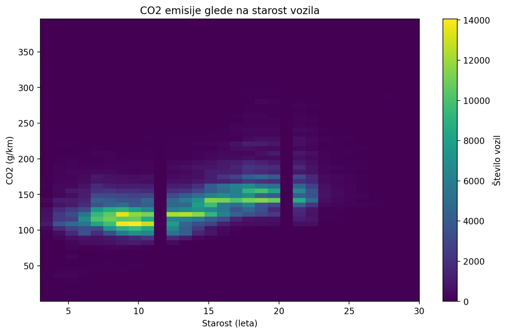

Preučili smo tudi razmerje med maso in močjo vozila. Vidimo pozitivno korelacijo — večja vozila imajo praviloma močnejše motorje, z največjo gostoto vrednosti med 1000–1500 kg in 80–150 kW.

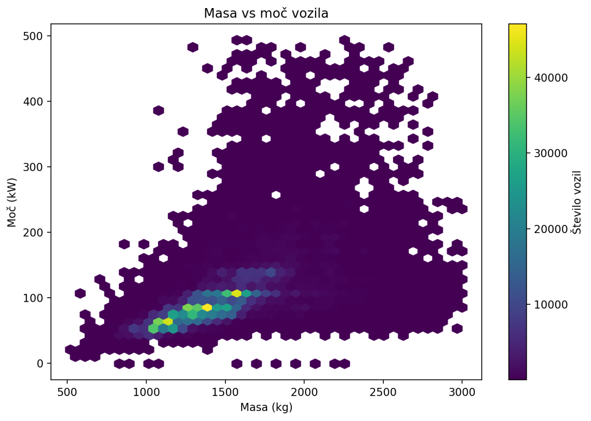

Nato smo ugotavljali, kateri modeli in znamke so najbolj priljubljeni, da smo lahko zgradili napovedovalni model. Najbolj priljubljeni so: Renault Clio, Volkswagen Passat (karavan), Volkswagen Golf, Citroën Berlingo, Peugeot 208 in Kia Ceed. Nekateri modeli se pojavijo večkrat, ker smo jih ločevali glede na motor za natančnejšo analizo.

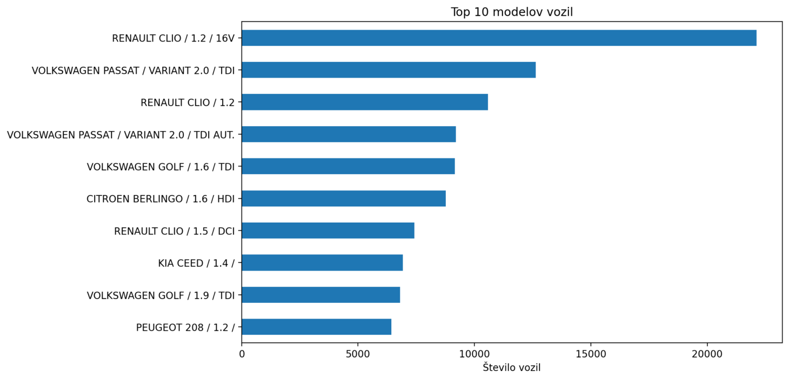

Da cena narašča s prostornino motorja, smo ugotovili z analizo za vsak priljubljen model. Tukaj je primer za Volkswagen Golf — cena narašča z velikostjo motorja, kar velja že pri novih avtomobilih, saj jih proizvajalci prodajajo po tej logiki.

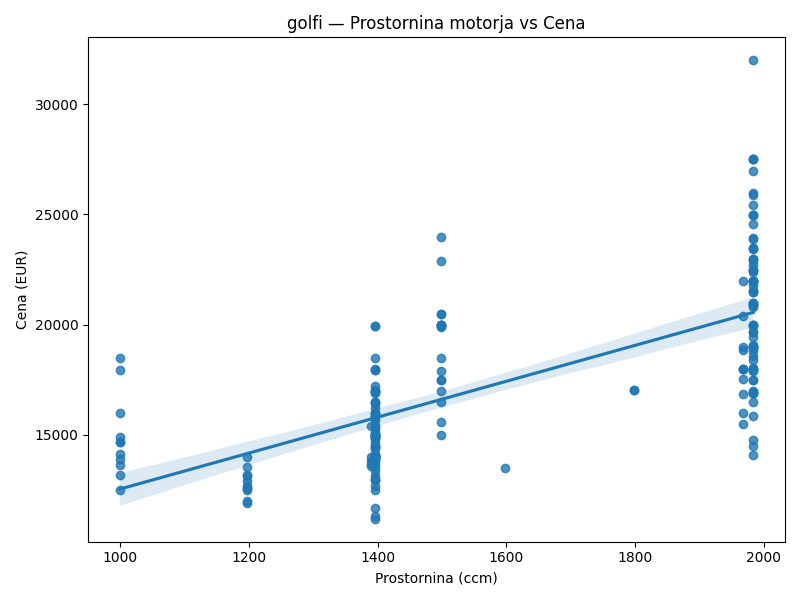

Za vsak model smo izvedli korelacijsko analizo numeričnih atributov ter analizo pomembnosti spremenljivk (feature importance) z algoritmom RandomForest. Ugotovili smo, da moč motorja, prostornina in število dodatkov opreme (feature_count) najbolj vplivajo na ceno. Poleg tega imajo avtomobili z avtomatskim menjalnikom praviloma višjo ceno.

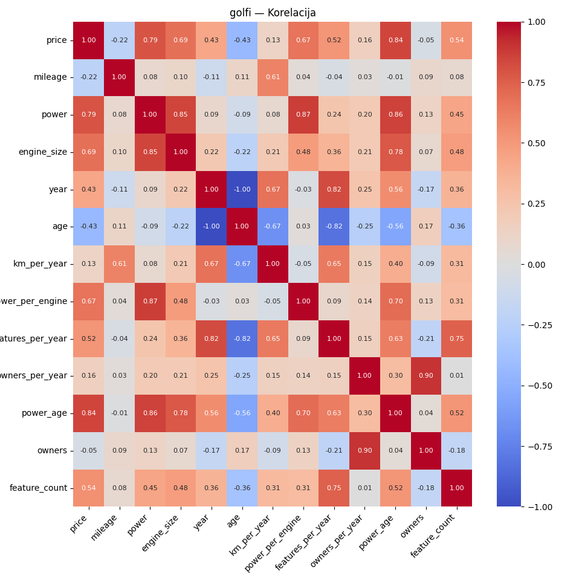

S temi ugotovitvami smo določili vhodne spremenljivke za napovedni model. Pri gradnji modela smo ugotovili, da je leto prve registracije prav tako zelo pomemben dejavnik — kupci praviloma preferirajo novejši videz in opremo. Spodnji graf prikazuje vrednosti R² za vsak model posebej.

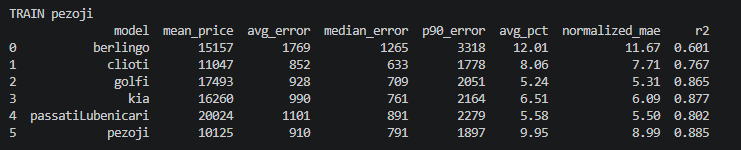

Graf prikazuje mediano napak za vseh 500 vozil vsakega modela. Model največjo napako dosega pri Berlingotih, kar je verjetno posledica velike raznolikosti izvedenk tega modela in posledično večjega razpona cen. Pri Cliu in Golfu je napaka manjša, ker imajo ti avtomobili bolj homogene karakteristike. Model v povprečju doseže MAE okoli 1.000 EUR pri 5-kratni prečni validaciji, kar je za trg rabljenih vozil zadovoljiv rezultat.

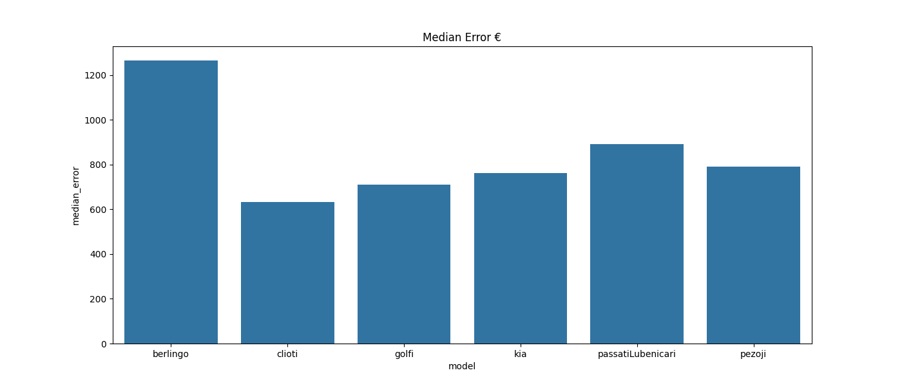

## Streamlit aplikacija

Pomemben rezultat projekta je interaktivna Streamlit aplikacija.

Uporabnik lahko:

pregleduje ključne grafe in ugotovitve analize,
raziskuje podatke iz evidence registriranih vozil,
vnese lastnosti izbranega vozila,
pridobi napoved tržne vrednosti vozila,
primerja rezultat s podobnimi vozili iz baze podatkov.

Aplikacija omogoča enostavno uporabo rezultatov projekta tudi uporabnikom brez programerskega znanja.

## Zaključek

Analiza je pokazala, da se slovenski vozni park postopoma spreminja. Bencinska vozila postajajo vse bolj priljubljena, hkrati pa hitro raste tudi število električnih vozil, predvsem v urbanih območjih. Novejša vozila proizvajajo manj emisij CO₂, kar kaže na tehnološki napredek avtomobilske industrije.

Pri napovedovanju cen rabljenih vozil se kot najpomembnejši dejavniki izkažejo moč motorja, prostornina motorja, dodatna oprema in leto prve registracije. Razviti model dosega povprečno napako približno 1.000 EUR in omogoča uporabno oceno tržne vrednosti vozila.

Vsa izvorna koda, podatki za analizo ter Streamlit aplikacija so vključeni v repozitorij projekta na GitHubu.